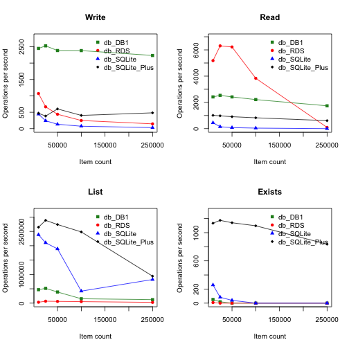

### Overview

This document provides a brief performance analysis of the filehash package.  Test data shows that:

1. dbWrite-intensive applications should use the DB1 filehash.

2. dbRead-intensive applications of less than 100,000 elements should use the RDS filehash.
Those with more than 100,000 elements should use a DB1 filehash.

3. dbList-intensive and dbExists-intensive databases should use a modified SQLite filehash.

The following charts summarize our performance tests.



### filehashSQLite Modifications

Only minor changes were required to achieve the performance benefits associated with the
filehashSQLite variant labeled SQLite_Plus in the charts above.

1. Add a unique key index.

2. Remove the delete before add operation.

3. Change SQL "INSERT" operation to "INSERT OR REPLACE".

4. Perform existence checks using index lookup rather than listing all keys and using
R's `%in%` operator.

Code changes are captured in the filehash-SQLite.R change history.

### Test Environment


```r
sessionInfo()
```

```
## R version 3.0.3 (2014-03-06)
## Platform: x86_64-apple-darwin10.8.0 (64-bit)
## 
## locale:
## [1] en_US.UTF-8/en_US.UTF-8/en_US.UTF-8/C/en_US.UTF-8/en_US.UTF-8
## 
## attached base packages:
## [1] stats     graphics  grDevices utils     datasets  methods   base     
## 
## other attached packages:
## [1] markdown_0.7   knitr_1.6      filehash_2.2-2 RSQLite_1.0.0 
## [5] DBI_0.3.1      stringi_0.2-5 
## 
## loaded via a namespace (and not attached):
## [1] digest_0.6.4     evaluate_0.5.5   formatR_0.10     htmltools_0.2.4 
## [5] rmarkdown_0.3.10 stringr_0.6.2    tools_3.0.3      yaml_2.1.11
```


